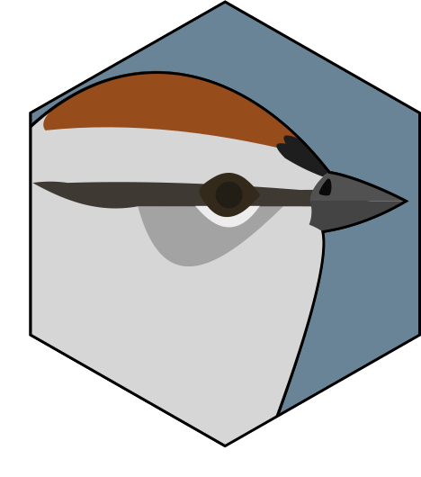

# TrillR 

<!-- badges: start -->

[](https://www.tidyverse.org/lifecycle/#experimental)


<!-- badges: end -->
## Overview
The ``TrillR`` package was originally developed as a few functions to assist in the random selection of wildlife accoustic recordings for species identification. This package has grown and is now part of a workflow for the selection of these recordings with the exclusion of bad weather days.

This package is largely dependent on using SoX - Sound eXchange which can be downloaded here: <https://sourceforge.net/projects/sox/files/sox/>. 

For additional improved functionality you can also use the accompanied TrillR App to increase the speed of selecting recordings. The latest release can be found here: <https://github.com/deanrobertevans/TrillRApp/releases>.

## Installation
The development version of the TrillR package can be downloaded in R.
```r
# install.packages("devtools")
devtools::install_github("deanrobertevans/TrillR")
```
## Usage

```r
library(TrillR)
```
### Set Location of sox.exe
Many of the functions in this package rely on SoX and therefore the location of the sox.exe file must be defined in R before doing any recording selection. 

To set the location use the  ``setsox.exe()`` function. You can specify a file path within the function or if it is left blank a file dialog will appear where you can choose the location.
```r
#Example
setsox.exe("Path/sox.exe")
```
### Getting .wav Data
It is recommended that you set your working directory to the location of all of your recordings. Then to read in the .wav data use the ``get.wavs()`` function.

This function is dependent on a standardized file structure where each location has its own folder of recordings. For example the sampling location LV-01-01-01 would have a folder named after this location conaining all recordings. Furthermore, the recording files must also be named using a standardized format that contains the location, date, and time seperated by underscore:
> **location_date_time.wav**

 Using the above location as another example a recording file name would look like this: 
 >**LV-01-01-01_20170609_033500.wav**

As long as the required structure above is met then you can read in the data. By default wavs will be searched for in the working directory but a different directory can be specified. Start dates and end dates can also be specified to remove any recordings that may not be of interest. Lastly, you can specify if you want to get the file duration of each file when reading in your wav data. This is optional because it can be quite time consuming but it can also be useful to remove any recordings that may not be long enough for selection.

```r
data <- get.wavs(directory=getwd(), start.date = "2017-06-01", end.date = "2017-06-30", getDuration=T)
```
Your data should look something like this:

| file.path                                                                      | basename                    | location    | datetime        | JDay | file.duration |
|--------------------------------------------------------------------------------|-----------------------------|-------------|-----------------|------|---------------|
| C:/Users/deane/Desktop/TrillR/Test/LV-01-01-01/LV-01-01-01_20170609_033500.wav | LV-01-01-01_20170609_033500 | LV-01-01-01 | 2017-06-09 3:35 | 160  | 600           |
| C:/Users/deane/Desktop/TrillR/Test/LV-01-01-01/LV-01-01-01_20170609_035100.wav | LV-01-01-01_20170609_035100 | LV-01-01-01 | 2017-06-09 3:51 | 160  | 600           |

### Merging Location Data
Coordinates for each location can be used to calculate things such as sunrise and sunset. In order to non destructively merge coordinates to your recording data use the `mergelocations()` function. This function provides checks and warns you of any missing locations before merging your data.

```r
library(readxl)
locationdata <- read_excel("LV.xlsx")

data <- mergelocations(data, locationdata, locationname = "Location", Latitude="Latitude", Longitude="Longitude")
```
### Calculating Sun Times
Using specific sun times can be really important for determining species presence in acoustic recordings. Building off of the `getSunlightTimes()` function from the `suncalc` R package, the `TrillR` function `getSunCalcs()` adds the ability to calculate any of times of importance and append a column for those times to your recording dataset. 

Available sun time calculations are: solarNoon, sunrise, sunset, sunriseEnd, sunsetStart, nightEnd, and goldenHourEnd. See the `suncalc` package for more details. Latitude and Longitude must be existings columns in order to use `getSunCalcs()`. In addition, support for parallel processing for `getSunCalcs()` has been added for increased speed when dealing with many recordings. 

```r
data <- getSunCalcs(data, calc = c("sunrise","sunset"), doParallel=T)
```

### Assigning Categories
Assigning recordings into specific categories based on their times is an important step in recording selection. This is where the `categorize()` function comes in to assign a category based on inclusive start and end dates/times. This function works on its own or with dplyr for added functionality.

Start and end dates can be in four formats: integer yday, character ("YYYY-MM-DD"), date format, or POSIXct.

Start and end times can be in three formats: character ("HH:MM:SS"), hms format, or POSIXct.

```r
data <- categorize(data,"EN","2017-06-01","2017-06-15","22:00:00","01:00:00")
#or use dplyr and calculate fields
data <- data %>%  dplyr::group_by(location) %>% dplyr::mutate(start.date=min(JDay),end.date=ceiling(mean(c(max(JDay),min(JDay)))),start.time=as_hms(sunset-3600),end.time=as_hms(sunset+3600)) %>%
categorize("EN",start.date,end.date,start.time,end.time)
```

### Creating Spectrograms
